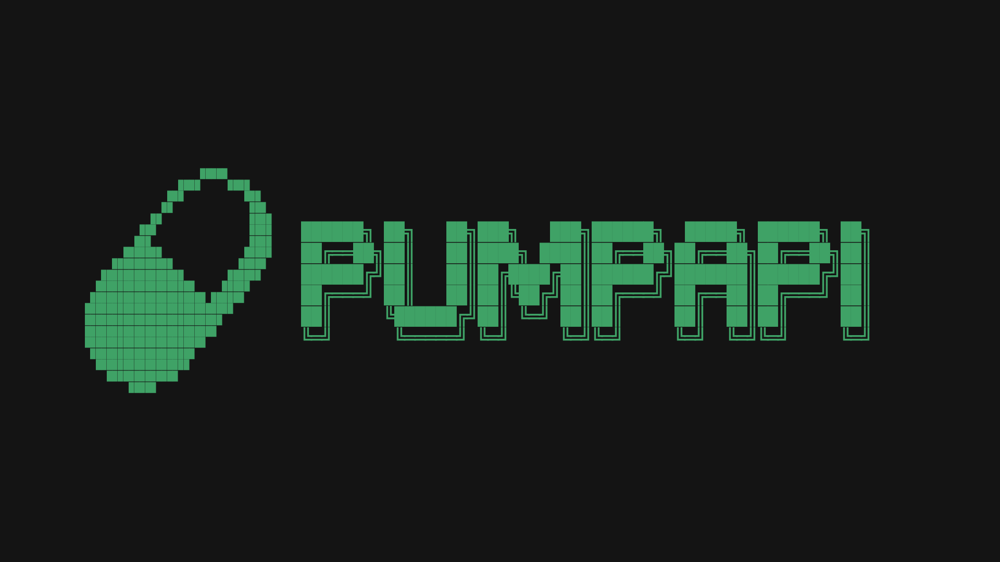

High-level API for [pump.fun](https://pump.fun) and pump_amm programs on Solana. Provides WebSocket subscriptions for real-time event monitoring, REST endpoints for token data retrieval, and transaction building endpoints for buying, selling, and creating tokens.

## Installation

```bash
npm install
```

## Configuration

Set your Solana RPC URL in `.env`:

```env
SOLANA_RPC_URL=https://api.mainnet-beta.solana.com
```

- `SOLANA_RPC_URL`: If not set, defaults to `https://api.mainnet-beta.solana.com`

**Note:** The private key for signing transactions is provided in each POST request body, not in environment variables.

## Usage

Start the server:

```bash
npm start
```

Server runs on port `3000` by default (configurable via `PORT` environment variable).

## REST API

All HTTP endpoints are under the `/api` prefix.

### API Root

```http
GET /api
```

Returns the list of available endpoints (WebSocket and HTTP). `GET /` redirects to `/api`.

### Token Info

```http
GET /api/info/:mint
```

Fetches token information including metadata and bonding curve data.

**Parameters:**
- `mint` (path): Token mint address (Solana public key, 32-44 characters)

**Example:**
```bash
curl http://localhost:3000/api/info/F1b5B2dnYTPMViJ3Gtn1DLSQAwxPn42RdVzdpvrepump
```

**Response:**

```json
{
  "mint": "F1b5B2dnYTPMViJ3Gtn1DLSQAwxPn42RdVzdpvrepump",
  "bondingCurve": "HLmFrsxFKNhA5ogZ3H5SnM5QRCG1LxpM6oDigsRFGz7M",
  "complete": false,
  "creator": "...",
  "isMayhemMode": false,
  "metadata": {
    "name": "PenguCoin",
    "symbol": "PENGUCOIN",
    "uri": "https://ipfs.io/ipfs/...",
    "decimals": 6,
    "supply": "1000000000000000"
  }
}
```

### Derive Bonding Curve

```http
GET /api/info/derive/:mint
```

Derives the bonding curve PDA address from a mint address using the pump.fun program seeds.

**Parameters:**
- `mint` (path): Token mint address

**Example:**
```bash
curl http://localhost:3000/api/info/derive/F1b5B2dnYTPMViJ3Gtn1DLSQAwxPn42RdVzdpvrepump
```

**Response:**
```json
{
  "bondingCurve": "HLmFrsxFKNhA5ogZ3H5SnM5QRCG1LxpM6oDigsRFGz7M"
}
```

**Note:** This endpoint performs PDA derivation only. No account data is fetched or decoded.

### Top Holders

```http
GET /api/topholders/:mint
```

Returns top token holders for a mint. Responses are cached for 60 seconds.

**Parameters:**
- `mint` (path): Token mint address

**Example:**
```bash
curl http://localhost:3000/api/topholders/F1b5B2dnYTPMViJ3Gtn1DLSQAwxPn42RdVzdpvrepump
```

### Buy Tokens

```http
POST /api/buy
```

Executes a buy transaction for tokens on pump.fun. Returns the transaction signature.

**Request Body:**
```json
{
  "mint": "F1b5B2dnYTPMViJ3Gtn1DLSQAwxPn42RdVzdpvrepump",
  "user": "YourWalletAddress...",
  "solAmount": 0.1,
  "slippage": 1,
  "privateKey": [1,2,3,...]
}
```

**Parameters:**
- `mint` (required): Token mint address (Solana public key)
- `user` (required): User wallet address (Solana public key)
- `solAmount` (required): Amount of SOL to spend (number or string in SOL, e.g., 0.1 for 0.1 SOL)
- `slippage` (optional): Slippage tolerance in basis points (default: 1)
- `privateKey` (required): Wallet private key as either:
  - JSON array of 64 numbers (secret key bytes): `[1,2,3,...]`
  - Base58 encoded string: `"5Kd3N8v..."` (base58 encoded secret key)

**Example:**
```bash
curl -X POST http://localhost:3000/api/buy \
  -H "Content-Type: application/json" \
  -d '{
    "mint": "F1b5B2dnYTPMViJ3Gtn1DLSQAwxPn42RdVzdpvrepump",
    "user": "YourWalletAddress...",
    "solAmount": 0.1,
    "slippage": 1,
    "privateKey": [1,2,3,...]
  }'
```

**Security Warning:** Never expose your private key in client-side code or logs. Always use secure channels (HTTPS) when sending private keys to the API.

**Private Key Formats:**
- JSON array: `[1,2,3,4,...]` (64 numbers)
- Base58 string: `"5Kd3N8v..."` (base58 encoded secret key)

**Response:**
```json
{
  "signature": "5j7s8K9LmN2pQrS4tU6vW8xY0zA1bC3dE5fG7hI9jK1lM3nO5pQ7rS9tU1vW3xY5z",
  "estimatedTokenAmount": "1234567890"
}
```

### Sell Tokens

```http
POST /api/sell
```

Executes a sell transaction for tokens on pump.fun. Sells a percentage of the tokens held by the user. Returns the transaction signature.

**Request Body:**
```json
{
  "mint": "F1b5B2dnYTPMViJ3Gtn1DLSQAwxPn42RdVzdpvrepump",
  "user": "YourWalletAddress...",
  "percentage": 50,
  "slippage": 1,
  "privateKey": [1,2,3,...]
}
```

**Parameters:**
- `mint` (required): Token mint address (Solana public key)
- `user` (required): User wallet address (Solana public key)
- `percentage` (required): Percentage of tokens to sell (number between 0 and 100). For example, `50` means sell 50% of the tokens you hold.
- `slippage` (optional): Slippage tolerance in basis points (default: 1)
- `privateKey` (required): Wallet private key as either:
  - JSON array of 64 numbers (secret key bytes): `[1,2,3,...]`
  - Base58 encoded string: `"5Kd3N8v..."`

**Example:**
```bash
curl -X POST http://localhost:3000/api/sell \
  -H "Content-Type: application/json" \
  -d '{
    "mint": "F1b5B2dnYTPMViJ3Gtn1DLSQAwxPn42RdVzdpvrepump",
    "user": "YourWalletAddress...",
    "percentage": 50,
    "slippage": 1,
    "privateKey": [1,2,3,...]
  }'
```

**Response:**
```json
{
  "signature": "5j7s8K9LmN2pQrS4tU6vW8xY0zA1bC3dE5fG7hI9jK1lM3nO5pQ7rS9tU1vW3xY5z",
  "estimatedSolAmount": "500000000"
}
```

**Note:** The API automatically fetches your current token balance and calculates the exact token amount to sell based on the percentage you specify.

### Create Token

```http
POST /api/create
```

Executes a transaction to create a new token on pump.fun. Optionally includes an initial buy in the same transaction. Returns the transaction signature.

**Request Body:**
```json
{
  "name": "My Token",
  "symbol": "MTK",
  "uri": "https://example.com/metadata.json",
  "creator": "CreatorWalletAddress...",
  "user": "UserWalletAddress...",
  "mint": "OptionalMintAddress...",
  "initialBuySolAmount": 0.1,
  "slippage": 1,
  "mayhemMode": false,
  "privateKey": [1,2,3,...]
}
```

**Parameters:**
- `name` (required): Token name
- `symbol` (required): Token symbol
- `uri` (required): Metadata URI (IPFS or HTTPS URL)
- `creator` (required): Creator wallet address (Solana public key)
- `user` (required): User wallet address (Solana public key)
- `mint` (optional): Pre-generated mint address. If not provided, a new unique address will be generated
- `initialBuySolAmount` (optional): Amount of SOL to spend on initial buy (number or string in SOL). If provided, creates and buys in the same transaction
- `slippage` (optional): Slippage tolerance in basis points (default: 1)
- `mayhemMode` (optional): Enable mayhem mode for the token (default: false). Uses Token-2022 program instead of standard Token program
- `privateKey` (required): Wallet private key as either:
  - JSON array of 64 numbers (secret key bytes): `[1,2,3,...]`
  - Base58 encoded string: `"5Kd3N8v..."`

**Example (Create Only):**
```bash
curl -X POST http://localhost:3000/api/create \
  -H "Content-Type: application/json" \
  -d '{
    "name": "My Token",
    "symbol": "MTK",
    "uri": "https://example.com/metadata.json",
    "creator": "CreatorWalletAddress...",
    "user": "UserWalletAddress...",
    "privateKey": [1,2,3,...]
  }'
```

**Example (Create with Initial Buy):**
```bash
curl -X POST http://localhost:3000/api/create \
  -H "Content-Type: application/json" \
  -d '{
    "name": "My Token",
    "symbol": "MTK",
    "uri": "https://example.com/metadata.json",
    "creator": "CreatorWalletAddress...",
    "user": "UserWalletAddress...",
    "initialBuySolAmount": 0.1,
    "privateKey": [1,2,3,...]
  }'
```

**Response:**
```json
{
  "signature": "5j7s8K9LmN2pQrS4tU6vW8xY0zA1bC3dE5fG7hI9jK1lM3nO5pQ7rS9tU1vW3xY5z",
  "mint": "GeneratedOrProvidedMintAddress...",
  "estimatedTokenAmount": "1234567890"
}
```

**Note:** The `estimatedTokenAmount` field is only included when `initialBuySolAmount` is provided.

### Health Check

```http
GET /api/health
```

Returns server health status and subscription metrics.

### Status

```http
GET /api/status
```

Returns detailed status of all active subscriptions, connection counts, and program information.

## WebSocket API

### New Pairs Stream

```javascript
ws://localhost:3000/ws/newpairs
```

Subscribes to `CreateEvent` events from the pump.fun program. Emits events when new token pairs are created via `create` or `create_v2` instructions.

**Event Format:**
```json
{
  "type": "newPair",
  "instructionType": "create" | "create_v2",
  "data": {
    "name": "Token Name",
    "symbol": "SYMBOL",
    "uri": "https://...",
    "mint": "...",
    "bondingCurve": "...",
    "user": "...",
    "creator": "...",
    "timestamp": "...",
    "virtualTokenReserves": "...",
    "virtualSolReserves": "...",
    "realTokenReserves": "...",
    "tokenTotalSupply": "...",
    "tokenProgram": "...",
    "isMayhemMode": false
  },
  "signature": "...",
  "slot": 123456789
}
```

**Example:**
```javascript
const ws = new WebSocket('ws://localhost:3000/ws/newpairs');
ws.onmessage = (event) => {
  const data = JSON.parse(event.data);
  // Handle new pair event
};
```

### Transaction Stream

```javascript
ws://localhost:3000/ws/txs?bondingCurve=<address>
ws://localhost:3000/ws/txs?=<address>
```

Subscribes to trade events for a specific bonding curve. Automatically detects program type (pump or pump_amm) and decodes events accordingly.

**Parameters:**
- `bondingCurve` (query): Bonding curve PDA address (required)

**Event Format:**
```json
{
  "type": "buy" | "sell",
  "amount": 0.123456789,
  "signature": "5j7s8K9L...",
  "timestamp": 1234567890
}
```

**Connection Response:**
```json
{
  "type": "connected",
  "message": "Connected to transaction stream for bonding curve: ...",
  "bondingCurve": "...",
  "subscriptionStatus": {
    "subscribed": true,
    "eventCount": 0,
    "programType": "pump" | "pump_amm",
    "programId": "..."
  }
}
```

**Example:**
```javascript
const bondingCurve = '9wcD5EBuHPj9r2Qb1ks5KQTzYPqDxNLCX1wnegY6w562';
const ws = new WebSocket(`ws://localhost:3000/ws/txs?bondingCurve=${bondingCurve}`);
ws.onmessage = (event) => {
  const data = JSON.parse(event.data);
  // Handle transaction event
};
```

## Architecture

### Event Subscription

The API uses Solana WebSocket subscriptions to monitor program logs:

- **New Pairs**: Subscribes to pump.fun program (`6EF8rrecthR5Dkzon8Nwu78hRvfCKubJ14M5uBEwF6P`) logs and filters for `CreateEvent` discriminators
- **Transactions**: Subscribes to program logs based on bonding curve account owner, automatically determining whether to use pump or pump_amm IDL

### Account Decoding

Bonding curve accounts are decoded using Anchor IDLs:
- Pump program: `config/idl/pump/idl.json`
- Pump AMM program: `config/idl/pump_amm/idl.json`

Account data is decoded using BorshCoder from `@coral-xyz/anchor`.

### PDA Derivation

Bonding curve addresses are derived using:
- Seeds: `["bonding-curve", mint]`
- Program: `6EF8rrecthR5Dkzon8Nwu78hRvfCKubJ14M5uBEwF6P`

### Commitment Levels

- New pairs: `processed` (faster event detection)
- Transactions: `finalized` (ensures transaction finality)

## Development

```bash
# Run with nodemon (auto-reload)
npm run dev

# Build TypeScript
npm run build

# Run production build
npm start
```

## Transaction Execution

The API provides endpoints for executing pump.fun transactions. These endpoints build, sign, and send transactions to the Solana network, returning the transaction signature upon success.

### How Transaction Execution Works

1. **Call the endpoint** - Send a POST request to `/api/buy`, `/api/sell`, or `/api/create`
2. **Server processes** - The server builds the transaction, signs it with the configured server wallet, and sends it to the network
3. **Receive signature** - The response contains the transaction signature, which can be used to track the transaction on Solana

**Example (JavaScript/TypeScript):**
```typescript
// Execute buy transaction
const response = await fetch('http://localhost:3000/api/buy', {
  method: 'POST',
  headers: { 'Content-Type': 'application/json' },
  body: JSON.stringify({
    mint: 'F1b5B2dnYTPMViJ3Gtn1DLSQAwxPn42RdVzdpvrepump',
    user: 'YourWalletAddress...',
    solAmount: 0.1,
    slippage: 1
  })
})

const { signature, estimatedTokenAmount } = await response.json()

console.log(`Transaction signature: ${signature}`)
console.log(`Estimated tokens: ${estimatedTokenAmount}`)

// View transaction on Solana Explorer
console.log(`View on explorer: https://solscan.io/tx/${signature}`)
```

### Transaction Signing

All transactions are signed using the `privateKey` provided in the request body. The wallet associated with the private key:
- Pays for transaction fees
- Signs all transactions
- Must have sufficient SOL balance for fees and token purchases

**Important:** 
- The `privateKey` can be either:
  - A JSON array of 64 numbers: `[1,2,3,...]` (secret key bytes)
  - A base58 encoded string: `"5Kd3N8v..."` (base58 encoded secret key)
- The `user` parameter should match the public key derived from the `privateKey`
- Always use HTTPS when sending private keys to protect sensitive information
- Never log or expose private keys in error messages or responses

### Error Handling

All transaction endpoints return appropriate HTTP status codes:
- `400` - Invalid request parameters
- `500` - Server error or blockchain interaction failure

Error responses include:
```json
{
  "error": "Error type",
  "message": "Detailed error message"
}
```

## Dependencies

- `@solana/web3.js` - Solana blockchain interaction
- `@coral-xyz/anchor` - Anchor IDL decoding
- `@pump-fun/pump-sdk` - Pump.fun SDK for transaction building
- `@pump-fun/pump-swap-sdk` - Pump swap SDK
- `express` - HTTP server
- `ws` - WebSocket server
- `typescript` - TypeScript support
- `bn.js` - Big number arithmetic
- `bs58` - Base58 encoding/decoding for private keys

## License

MIT

